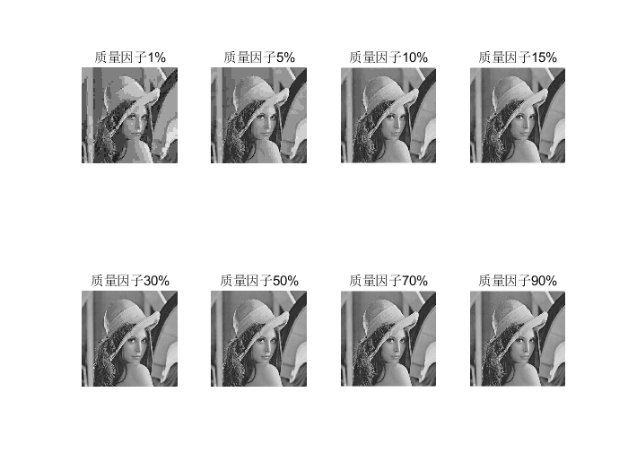
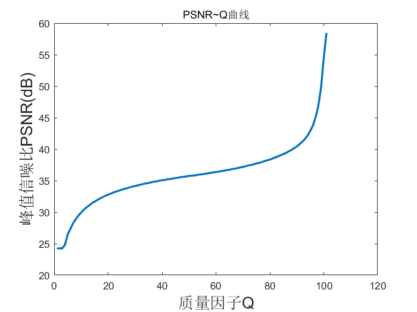
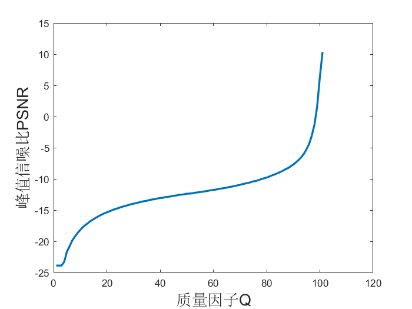
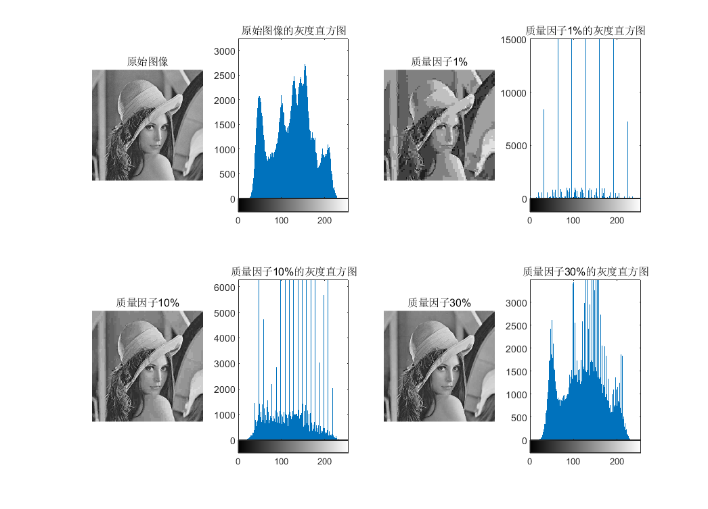
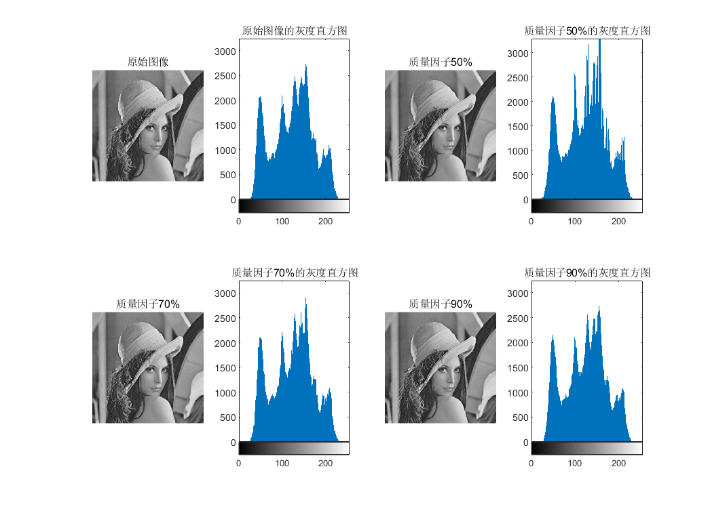
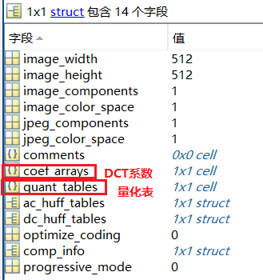

# <center> 图像基本处理以及图像JPEG压缩
##### <center> 赵紫如
###### <center> 学号：201711123020 班级：信息安全2017级

# 1 测试环境
(1) 实验图像：512x512的灰度图像(即lena512.bmp)和512x512的彩色图像(即lena512.tif)。

(2) 使用的工具：MATLAB R2018a。
  
# 2 实验目的
(1)熟悉Matlab图像处理编程环境；

(2)图像JPEG压缩实验。

# 3 实验内容

## 3.1 模拟数字图像JPEG压缩，绘制PSNR~Q曲线

### 3.1.1 读入图片

(1) 用imread读入灰度图片。

```matlab
% imread返回值类型为uint8，读入一张灰度图片
im=imread('lena512.bmp');
```
(2) 读入彩色图片，需要转换颜色空间，通过matlab内置函数rgb2ntsc，即将读入的图像由RGB空间转化为NTSC空间。NTSC的亮度通道图像是YIQ图像的第一个颜色通道。

```matlab
% imread返回值类型为uint8
im=imread('lena512.bmp');
% convert the image to YIQ color space
y=rgb2ntsc(im);
% get the NTSC luminance value
% represented by the first color channel in the YIQ image.
y=y(:,:,1);
```

### 3.1.2 遍历质量因子，得到压缩后的图片

(1) 质量因子$q$的范围是$0~100$，由$F_q(u,v)={F(u,v)\over q}$，我们可从理论上分析质量因子越大，压缩的比重越小，损失越小。

(2) 遍历质量因子的范围0~100，得到101张lena图像。
```matlab
path='images/';
im=imread('lena512.bmp');
% get the images when Quality change between 0-100 
for i=0:100
    % 将文件以编号重命名放入images文件夹中
    savename=[num2str(i),'.jpg'];
    savename=[path,savename];
    % imwrite可以实现JPEG压缩并指定质量因子
    imwrite(im,savename,'jpg','Quality',i);
end
```
通过画图展示当质量因子q为特殊值1，5，10，15，30，50，70，90，JPEG图像的质量的变化情况。
```matlab
q=[1, 5, 10, 15, 30, 50, 70, 90];
num=1;
for i=q
    imwrite(im,'test.jpg','jpg','Quality',i);
    subplot(2,4,num),imshow(imread('test.jpg')),title(['质量因子',int2str(i),'%']);
    num=num+1;
end
```
从实验上验证我们的分析，可得如下对比图1。


<center> 图1 不同质量因子的JPEG图像

### 3.1.3 绘制PSNR~Q曲线

(1) PSNR(Peak Signal-to-Noise Ratio)峰值信噪比，PSNR越高，压缩后失真越小。

(2) 根据公式$PSNR=10*log_{10}({MAX_I^2 \over MSE})$，$MAX_I$为最大像素值(8bit的灰度图像为255)，$MSE$是均方差，计算公式为$MSE={1\over mn}\sum_{i=0}^{m-1}\sum_{j=0}^{n-1}||I(i,j)-K(i,j)||^2$，$I$为原图像，$K$为失真后图像，(m,n)为图像尺寸。

```matlab
im=imread('lena512.bmp');
[h w]=size(im); 
im=double(im);
ans=zeros(1,101);
ans=double(ans);
% 位深度
bit=8;
% 当前图像的最大像素值
fmax=2.^bit-1;
MAX=fmax.^2;
for i=0:100
    readname=[path,num2str(i)];
    readname=[readname,'.jpg'];
    read=imread(readname);
    read=double(read);
    % 矩阵可以直接相减
    MES=sum(sum((im-read).^2))/(h*w);
    ans(i+1)=10*log10(MAX/MES);
end 
```
处理后的曲线为图2。


<center> 图2 PSNR~Q曲线

(3) 调用matlab的内置psnr函数

```matlab
% 注意用psnr函数不能把imread后得到的矩阵转为double，否则结果不对。
im=imread('lena512.bmp');
ans=zeros(1,101);
ans=double(ans);
for i=0:100
    readname=[path,num2str(i)];
    readname=[readname,'.jpg'];
    read=imread(readname);
    [peaksnr,snr]=psnr(read,im);
    ans(i+1)=peaksnr;
end
```
处理后的曲线为图3，和图2的结果一致。


<center> 图3 调用psnr函数绘制PSNR~Q曲线

### 3.1.4 实验结果分析

(1) PSNR的指标：PSNR高于40dB说明图像质量极好（即非常接近原始图像）；在30—40dB通常表示图像质量是好的（即失真可以察觉但可以接受）；在20—30dB说明图像质量差；PSNR低于20dB图像不可接受。
(2) 在质量因子为0~20和80~100时，图像的PSNR变化较快；质量因子为20~80时，变化较为缓慢。

## 3.2 显示压缩前后的灰度直方图，观察并分析所存在的差异

### 3.2.1 选择特殊的质量因子，绘制灰度直方图

(1) 选择q为1，10，30，50，70，90，用内置函数imhist绘制灰度直方图。

```matlab
% q=[1,10,30];
q=[50,70,90];
num=1;
im=imread('lena512.bmp');
subplot(2,4,num),imshow(im),title('原始图像');
num=num+1;
subplot(2,4,num),imhist(im),title('原始图像的灰度直方图');
for i=q
    name=[path,num2str(i),'.jpg'];
    read=imread(name);
    num=num+1;
    subplot(2,4,num),imshow(read),title(['质量因子',int2str(i),'%']);
    num=num+1;
    subplot(2,4,num),imhist(read),title(['质量因子',int2str(i),'%的灰度直方图']);
end
```

imhist函数绘图的横坐标是灰度级，在此处则是从0到255，纵坐标是每一个灰度级在图像中出现的个数。


<center> 图4 质量因子q为1，10，30的图像灰度直方图


<center> 图5 质量因子q为50，70，90的图像灰度直方图


(2) 若不用内置函数imhist，则需要手动实现对读入的灰度图片进行0~255像素点出现个数的统计，实现代码如下。

```matlab
im=imread('lena512.bmp');
im=double(im);
len=512;
% 若写成zeros(1:256)会报错超出了程序允许的最大变量值。
gray=zeros(1,256);
for i=1:len
   for j=1:len 
       % 取像素值并且转为整形才能用于下标访问
       ind=uint8(im(i,j));
       % 像素值可能为0
       ind=ind+1;
       % 将对应的像素值的统计量++
       gray(ind)=gray(ind)+1;
   end
end

%内置函数bar画柱状图
bar(gray);
xlabel('灰度级(8bit)','FontSize',8);
```

图6是对应lena512.bmp的灰度直方图的绘制，生成的灰度直方图和用imhist生成的相同。

### 3.2.2 实验结果分析

(1) 当质量因子越高，JPEG压缩图像的直方图越接近原图。

(2) 当质量因子很低时，直方图的灰度级的分布不集中、稀少且与原图的直方图差异很大。

(3) 问题：为什么不能用imhist？histogram只能画直方图(不推荐使用hist)，则要自己统计图像中灰度级出现的个数，所以很麻烦。imhist需要什么内置参数？


## 3.3 读取JPEG图像文件

编程解码提取第x（学号后两位）个宏块的量化后DCT系数、模拟反量化和逆DCT变换，恢复并显示对应空域图像块，观察并分析JPEG压缩引起的块效应

### 3.3.1 提取JPEG文件的结构

#### 用nsf5的jpeg_read读取数字图像文件信息

(1) 用imwrite将lena512.bmp转为lena512.jpg，因为要处理的是一个jpeg格式的图像。

```matlab
im=imread('lena512.bmp');
imwrite(im,'lena512.jpg','.jpg');
impath='lena512.jpg';
```

(2)用nsf5中的jpeg_read读取该图像以及其DCT系数。已知jpeg_read的返回值是一个结构体，如图7所示。
    


```matlab
% a JPEG image structure
im=jpeg_read(impath);
% DCT plane
DCT=im.coef_arrays{1};
```

#### 学号为20，则找到第20个8*8的小块的DCT系数

```matlab
% 160=20*8;
% 153=19*8+1;
block=DCT(1:8,153:160);
```

#### 模拟反量化和逆DCT变换

(1) JPEG解压缩的过程如图7，在JPEG压缩的过程中，先对像素值进行-128的平移操作，然后再进行DCT变换，最后进行量化，然后取整。
    


(2) 通过jpeg_read读取的量化后的DCT系数和量化表，进行反量化和逆DCT变换。
    

```matlab
% get the quantization table
qtable=im.quant_tables{1};

% 反量化
qblock=block.*qtable
rblock=idct2(qblock)
% 在块20有误差的做法，先取整在移位
% rblock=uint8(rblock);
% 128-shift
% rblock=rblock+128;
% 在块20无误差的做法，先移位再取整
rblock=uint8(rblock+128)

```

#### 恢复并显示对应空域的图像块

通过对比原图和jpeg解压缩后的图像，查看恢复图像是否出现了误差，从视觉上没有什么误差，从数据分析上也是相同的，所以恢复成功。

```matlab
img=imread(impath);
% 20th-8*8的块
% (1:8,153:160)
img=img(1:8,153:160);
subplot(1,2,1),imshow(img),title('原始图像');
subplot(1,2,2),imshow(rblock),title('反变换的图像');

```
图8是两个图像块的对比图。


### 3.3.2 观察并分析JPEG压缩引起的块效应

(1) 由于8*8的分块看不出什么块效应，几乎都是同一个颜色，所以我把块的大小设置为64x64，测试当质量因子为1,5,10,50,90的情况下，图像块的情况。


(2) 实验结果分析：当质量因子越小时，我们可以明显的看到整个图像块由很多小块组成，即块边缘特别清晰；随着质量因子增加，块边缘逐渐模糊，变得平滑。

# 4 参考资料
(1) 文件格式的说明：
* TIFF(Tag Image File Format)标签图像文件格式，是灵活的位图格式，主要用来储存包括照片和艺术图在内的图像
* PNG(Portable Network Graphics)便携式网络图形，一种无损压缩的位图片形格式

(2) [读取JPEG文件的压缩质量/质量因子参数](https://blog.csdn.net/gwena/article/details/71123734)

(3) matlab中内置函数imhist的实现过程(https://ww2.mathworks.cn/help/images/ref/imhist.html?s_tid=srchtitle)