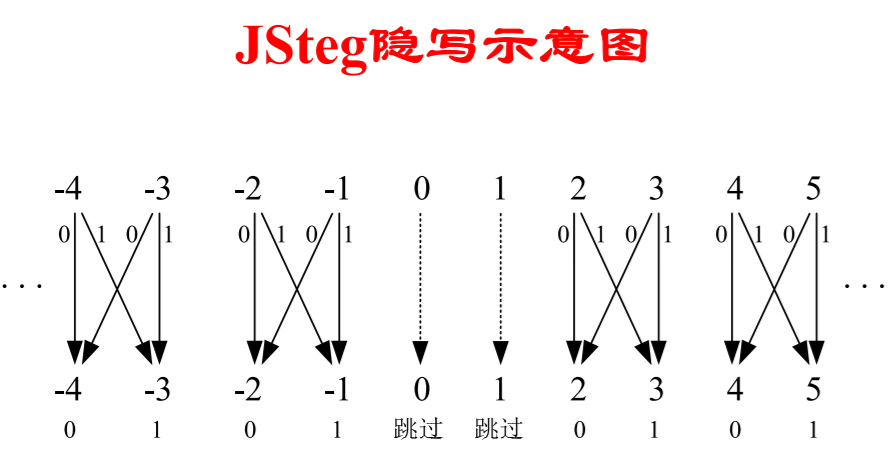
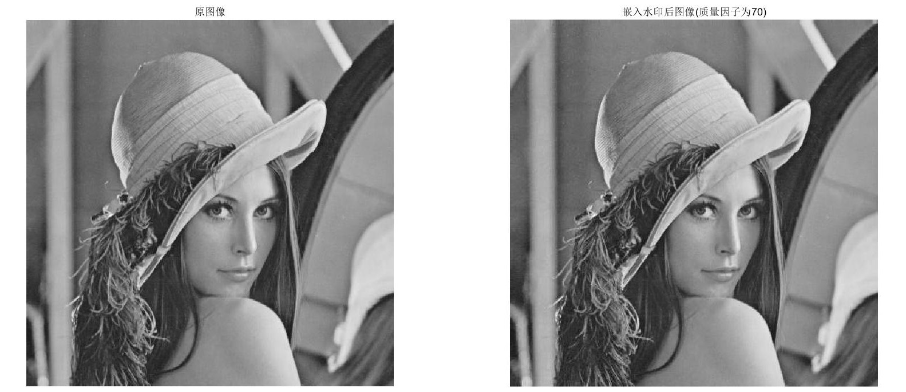
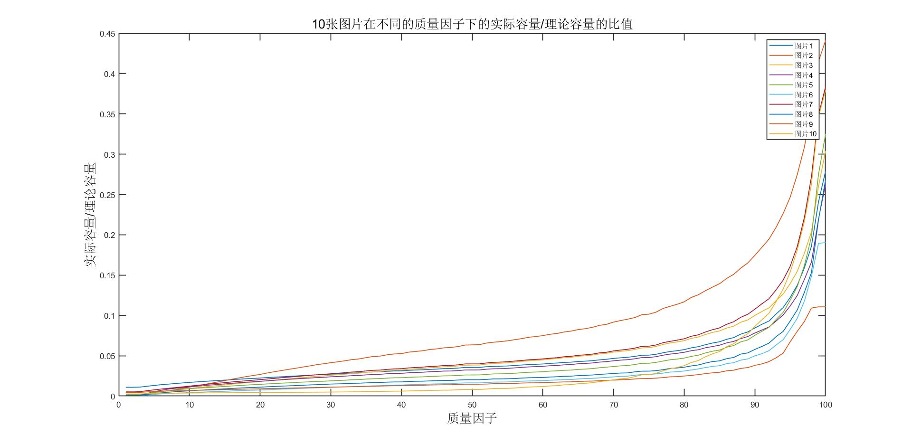
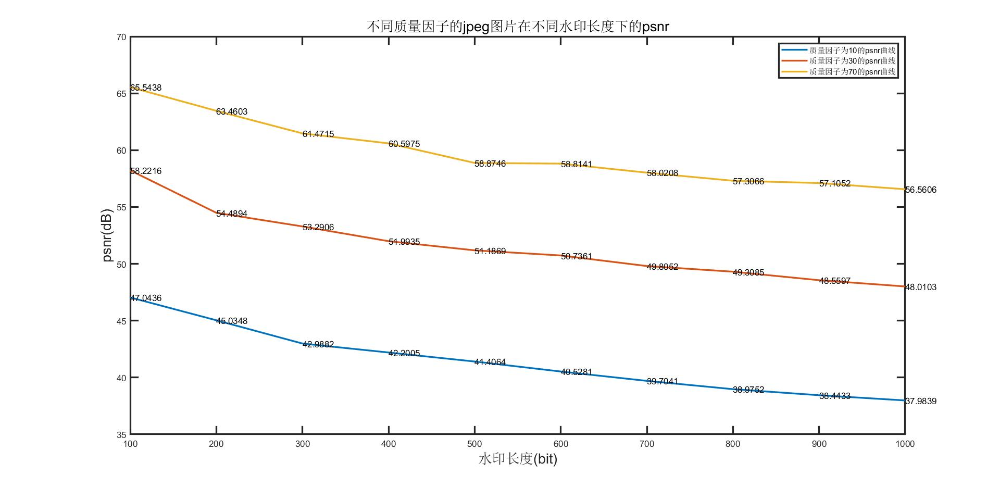
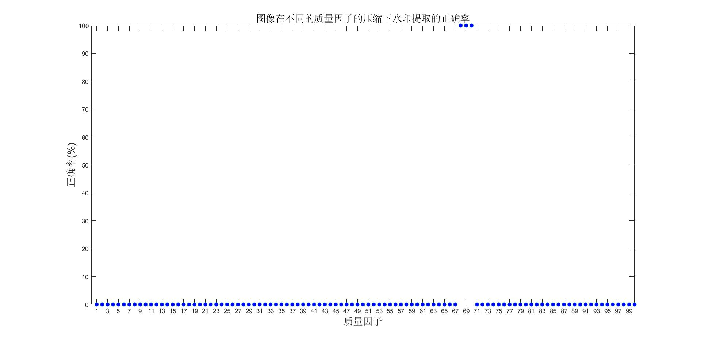
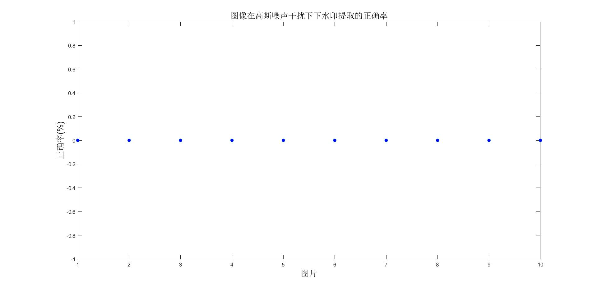
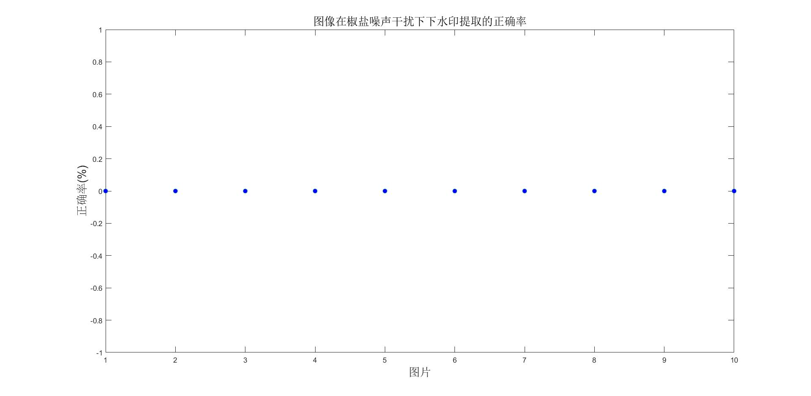
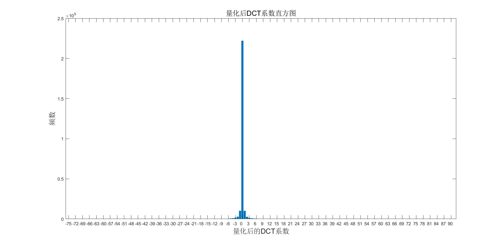
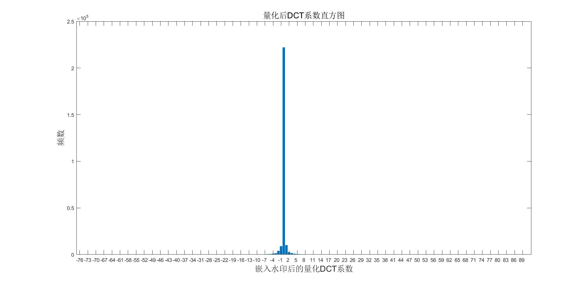
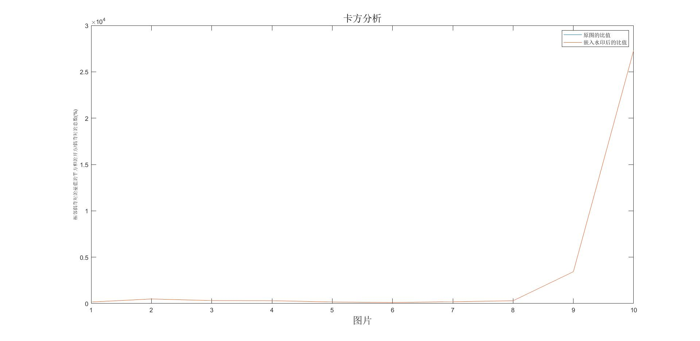

# <center> 图像信息隐藏算法仿真测试 </center>

##### <center> 赵紫如 </center>

###### <center> 学号：201711123020 班级：信息安全2017级 </center>

# 1 测试环境

(1) 实验图像：
* 原测试图像见images文件夹，包括10张png图片。
* 后续实验需要根据质量因子的不同，生成多张jpg图片进行处理。
* 信息嵌入和提取的测试图片是img5.png，它经过质量因子为70的jpeg压缩后得到一个jpg图片，对该jpg图片进行嵌入，秘密信息长度为10000比特，后面不再说明。

(2) 使用的工具：MATLAB R2018a。

# 2 实验目的

(1)仿真测试一种数字图像信息隐藏算法Jsteg；

(2)分析测试所研究算法的缺陷。

# 3 实验内容

## 3.1 仿真测试数字图像信息隐藏Jsteg算法

### 3.1.1 信息嵌入
  
(1) 生成秘密信息
* 确定秘密信息为0，1二进制。由于测试图像的最小尺寸为512x512，考虑最优情况能嵌入的秘密信息最多为$2^{18}$比特(肯定达不到，但是$2^8$范围的长度太短)，所以规定秘密信息的长度为16位二进制表示。将嵌入秘密信息的总长度假设为totallen=20，前16位一定要用于表示长度，只剩下4位，所以前16位为0000000000000100(长度4的二进制16位表示)，后4位用随机数rand生成。这20个0，1值一起作为秘密信息嵌入。
    ```matlab
    % 设置固定长度 0~255 可以用8位表示 256~65535 可以用16位表示 
    % 所以长度设置为16位二进制表示
    base = 16;
    % 如果要嵌入的信息总长为100，则剩下的随机数有100-16=84
    totlen = 100;
    len = totlen - base;
    bitlen = dec2bin(len,base)
    msg_fir = 1:base;
    for i = 1:base
        msg_fir(i) = bitlen(i) - '0';
    end
    % 前一个参数是生成数的区间 后一个参数是矩阵大小
    msg = randi([0,1],1,totlen - base);
    ```
* 将秘密信息存为文件，以便后续的对比。
    ```matlab
    % 合并两个数组 msg_fir;msg纵向拼接
    msg_tot = [msg_fir , msg];
    msg_tot = uint8(msg_tot);
    write_msg = msg_tot;
    % 将消息输入到txt文件，用于提取的对比
    savemsg = fopen('message.txt','w');
    fprintf(savemsg,'%d\n',write_msg);
    fclose(savemsg);
    ```

(2) 嵌入
* 用工具jpeg_read读取jpeg文件可以直接获取量化后的DCT系数，此时已经是整数。 
* 根据Jsteg的原理图可知，Jsteg是将LSB替换应用到jpeg图像中量化后的DCT系数，将量化后的除了为0和1的DCT系数嵌入秘密信息。总结来说，除了0和1，将要嵌入的DCT系数对2取余(用mod取余，可以实现对负数取余为非负整数)，如果该余数为1且秘密信息为0，则减1；如果该余数为0且秘密信息为1，则加1。
  
  
<center> 图1 Jsteg原理 </center>

* 代码以及实验结果见图2。从视觉上无法分析出差别。
  
    
    <center> 图2 原图和嵌入水印后的图像对比 </center>

    ```matlab
    % 将图像展平按列展开
    DCT_flatten = reshape(DCT,imd_r*imd_c,1);
    % 变成1行
    DCT_flatten = DCT_flatten';
    for i = 1:totlen
        while DCT_flatten(cnt) == 0 || DCT_flatten(cnt) == 1
            cnt = cnt + 1;
        end
        mo = mod(DCT_flatten(cnt),2);
        if mo == 1 && msg_tot(i) == 0
            DCT_flatten(cnt) = DCT_flatten(cnt) - 1;
        elseif mo == 0 && msg_tot(i) == 1
            DCT_flatten(cnt) = DCT_flatten(cnt) + 1;
        end
        cnt = cnt + 1;
    end
    % 恢复到原矩阵
    DCT_flatten = DCT_flatten';
    DCT_cha = reshape(DCT_flatten,imd_r,imd_c);
    % jpeg_write存图
    imd.coef_arrays{1} = DCT_cha;
    % stremb为保存路径
    jpeg_write(imd , stremb);
    ```

### 3.1.2 信息提取

(1) 提取长度信息
* 已知秘密信息的长度存储在前16位量化后的DCT系数中，所以先提取前16位01比特流，转化为整形的长度。通过判断除了0和1以外的量化后的DCT系数对2求余的数，如果是1，则该处的比特为1；如果是0，则该处为0。
    ```matlab
    %base:16
    for i = 1:base
        while DCT_flatten(cnt) == 0 || DCT_flatten(cnt) == 1
            cnt = cnt + 1;
        end
        mo = mod(DCT_flatten(cnt),2);
        if mo == 0
            secret =[secret,'0'];
            msg(i) = 0;
        else
            secret =[secret,'1'];
            msg(i) = 1;
        end 
        cnt = cnt + 1;
    end
    ```

(2) 根据长度，提取后续的秘密信息
* 通过长度控制循环的进行，判断方法如上，不再赘述。

(3) 通过欧式距离的思想判断信息的正确率
* 将嵌入前的秘密信息文件读入，和提取出的秘密信息进行求差，计算差值的平方和。
* 将平方和除以秘密信息总长度即为最终的错误率，正确率=1-错误率。
* 实验得出在质量因子为70、嵌入水印比特为10000的情况下的正确率为100%。原因是没有经过任何的jpeg后处理和其他操作，所以水印信息保持良好。

### 3.1.3 评价分析

#### 容量的分析
* 由于DCT系数为0和1的部分无法嵌入信息，然而在DCT变换后，0和1的个数出现的次数极多，所以能嵌入的容量大大减少，为此设计实验观察实际容量和理论容量的比值。
* 实验分析10张图片在jpeg量化中，质量因子从0到100的情况下实际容量的变化。
    ```matlab
    real_capacity = zeros(100,10);
    for i = 1:10
        file = [path , num2str(i),'.png'];
        im = imread(file);
        % 遍历质量因子
        for q = 1:100
            write_path = [path1,num2str(q),'.jpg'];
            imwrite(im,write_path,'jpg','Quality',q);     
            % jpeg_read读文件以及量化后的DCT系数 
            img = jpeg_read(write_path);
            DCT=img.coef_arrays{1};
            % DCT矩阵由于要分成8*8的块，所以会扩大
            % 这里不能取图像的长宽，而要取DCT矩阵的长宽
            [r,c] = size(DCT);
            % 统计0和1的值
            cnt_DCT = uint8(DCT);
            cn = sum(cnt_DCT(:)==0)+ sum(cnt_DCT(:)==1);
            real_capacity(q,i) = (r*c-cn)/(r*c);
        end
    string{i} = ['图片',num2str(i)];
    end
    ```
* 研究发现当随着质量因子的增加，图片的容量随之增加，呈凹函数曲线上升。当质量因子为90-95之间是急剧上升点，在90之前的容量比值很小，不到10%，而95之后，最优的图像也无法达到50%，说明Jsteg的容量在此实验环境的图像中，是较低的。该实验设计的缺点是图像样本容量太少，不一定数值具备普适性，但是曲线的变化趋势是具备普适性的。
  
  
<center> 图3 10副图像在不同质量因子下的实际容量/理论容量 </center>
  
#### 不可见性的分析
* 分析图像的PSNR，由于随之质量因子的降低，一幅图像经过jpeg压缩后的psnr是会降低的，所以我认为嵌入水印后的图像随着jpeg质量因子的变化的psnr曲线和不嵌入水印的曲线变化趋势是一样的，故只粗略分析当图像水印容量固定的情况下，嵌入水印的图像的psnr随质量因子为10、30、70的变化。实验证明当质量因子大的曲线在小的上方，说明在嵌入水印的情况下质量因子大的图像质量总是比质量因子小的图像不可见性好。
* 实验分析1张图片如img5.png在质量因子为10，30和70的情况下，嵌入不同长度的质量因子时，图像的psnr的变化。实验发现随着水印长度的增加，图像的psnr缓慢下降，不可见性变低，图像易被分析存在水印的可能性加大。
    
    <center> 图4 图像在质量因子为10、30、70的水印长度-psnr曲线图 </center>

#### 鲁棒性的分析

##### 压缩

* 对上述经过水印嵌入后的图片，对其进行不同的质量因子的jpeg压缩，观察水印提取的正确率。
  * 固定参数：固定一张图片，该图片是由png图片经过质量因子为70的jpeg压缩得到的jpg图片，对其嵌入10000比特的水印信息。实验代码见robustness.m文件。
  * 实验研究发现，只有在质量因子为70左右的图片才能正确提出水印，其他的都无法正确提取出水印长度，所以难以提取出正确的水印信息。可得Jsteg算法难以抵抗jpeg压缩中质量因子的变化。
        <center> 图5 经过不同质量因子的jpeg压缩后水印提取正确率的变化 </center>

##### 加噪

* 高斯噪声干扰，即添加均值为0、方差为0.005的高斯噪声，实验结果如图6。
    <center> 图6 经过高斯噪声处理后10幅图像的水印提取正确率的变化 </center>
* 椒盐噪声干扰，即添加噪声密度为0.01的椒盐噪声，实验结果如图7。
    <center> 图7 经过椒盐噪声处理后10幅图像的水印提取正确率的变化 </center>
* 根据上述两噪声的处理后，发现提取的正确率都为Jsteg算法无法抵抗噪声的干扰。实验代码见noise.m文件。
  
##### 几何变换

* imresize将图像缩放为原来的80%后，无法正确提出水印，说明Jsteg算法无法抵抗缩放的攻击。实验结果见图8，实验代码见resize.m文件。
    <center> 图8 经过80%的缩放处理后10副图像的水印提取正确率的变化 </center>

## 3.2 该算法的缺陷

### 卡方分析
* 正确率可见**3.1.3 评价分析的第(3)点鲁棒性**。
* 由于样本的不足和没有真正达到统计学分析的数量，目前观察到的卡方分析只能从可视化的角度上可以发现相邻两个偶奇对的值在接近，但是无法出现相等的情况。其实也在某种程度上说明了该算法虽然有能被卡方分析，但是当样本不够多时，还是很难观察出来的。
  
    <center> 图9 未嵌入水印的量化后的DCT系数直方图 </center>

    <center> 图10 嵌入水印后的量化后的DCT系数直方图 </center>

* 理论分析10张图片的原图像和嵌入水印后的图像(图像都由png转为质量因子为70的jpg图像再进行嵌入)，相邻偶奇对的差值的平方和的开方/偶奇对的个数的比值的大小比较。实验结果分析原图像的比值和嵌入水印后的比值是一样的，无法观察。实验代码见square.m文件。
    <center> 图10 嵌入水印后的量化后的DCT系数直方图 </center>

# 4 实验总结

1. 卡方分析，由于图像具有自己的特殊性，有些观察得到观察不到，而且程度也不深。总结得出需要更多的png样本图片，或者说是更精确的分析方法，比如说数据之间距离的比对，才能使得实验有说服力。
2. 注意DCT变换后，DCT矩阵和原像素矩阵的大小可能不相同，为了扩充成8x8会使得DCT矩阵变大。
3. Jsteg算法经过后处理和一些操作后的特别脆弱，容易被破坏。