- 关于对比度增强研究了两个方面，现实应用场景：待补充
- 局限性：在经过CE(对比度增强)处理后，不能再经过如jpg压缩或者加噪等其他操作，否则算法失效

# 1. 全局的对比度增强
- 仿真情形：整幅图片经过gamma校正
- 原理：检测谷单元，后面的局部检测基于这个原理
    以lena的灰度图为例检测谷单元
    - 原图经过对比度增强后的灰度直方图，会有谷单元
    - 原图经过jpg压缩后的灰度直方图，无谷单元
    - 将原图经过jpg压缩后的图进行CE后的灰度直方图，出现谷单元
    - 说明对于原图还是经过jpg压缩后的图，经过CE后都能检测到谷单元。

        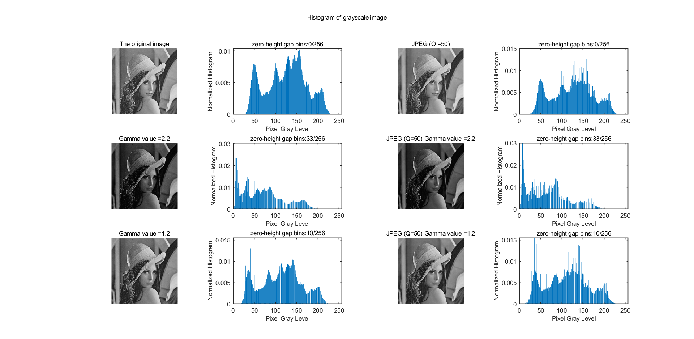
    
    - 缺点
      - 无法抵抗后处理的原因是，经过CE的原图压缩后无谷单元
      - 后处理，再次jpg压缩，无谷单元
      - 加噪，无谷单元
      - 旋转，未改变
      - 裁剪，未改变

        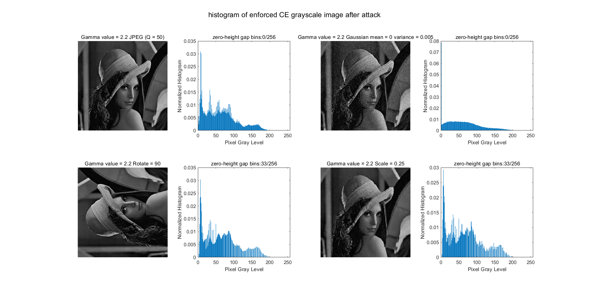

- 统计测试：
  
  - 10幅彩色png图片，对其亮度通道进行不同参数的gamma校正，在同一gamma参数的情况下，10幅图片的谷值/256的平均概率

      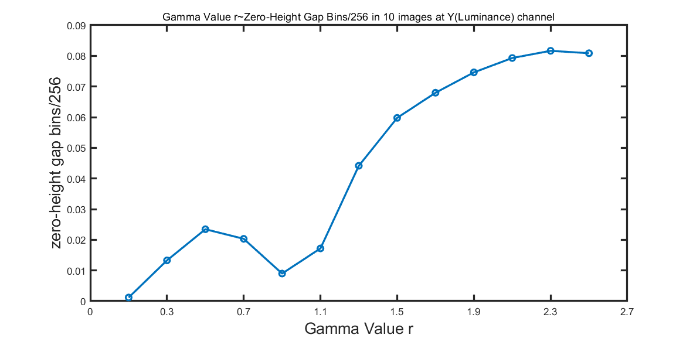

    分析: 参数大于1后，出现谷单元的数量是随着参数的增大而增大的，中间下降的原因是参数为1时，对图像没有gamma校正操作。

    **待解决：为什么会下凹？？？**

    γ<1 ：光照强度变强，称为 gamma compression
    γ>1：光照强度变弱，称为 gamma expansion

  - 攻击是否要做统计性测试？ 

# 2. 双边对比度增强

- 仿真情形：先将整幅图片经过gamma校正，然后再选取局部位置进行不同参数的gamma校正
- 对单幅图片的一些检测效果
    - 老师的测试图结果
          
      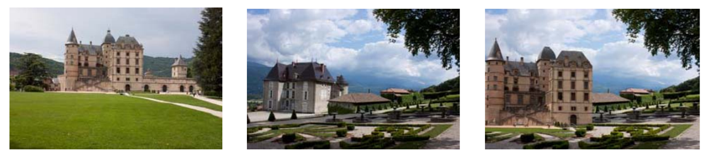
          
      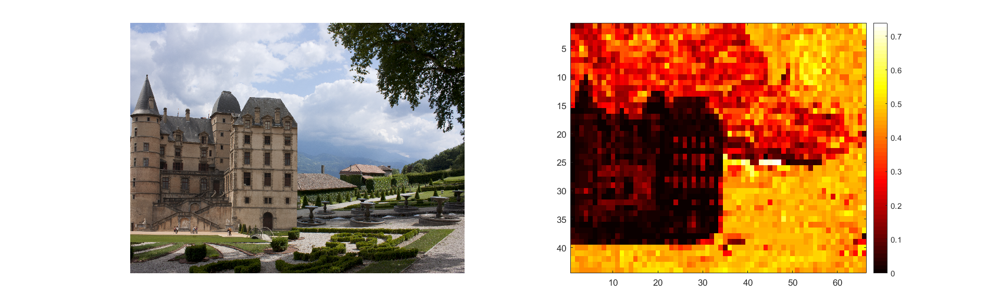
          
      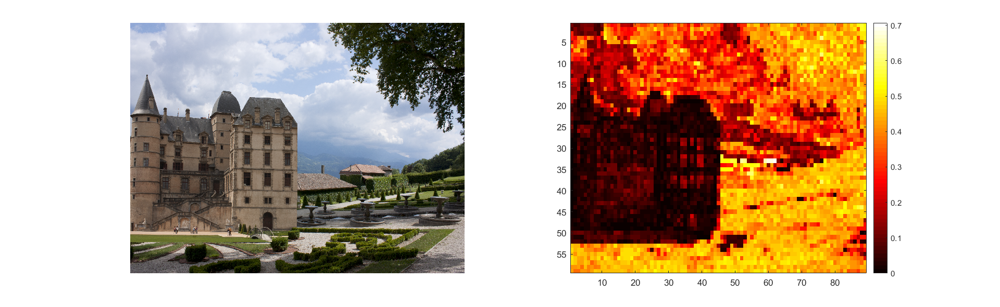
          
      - 自己的一些P图结果，保存为png
          
      图片一
          
      
          
      背景一
          
      
          
      合成图一
          
      
          
      检测一
          
      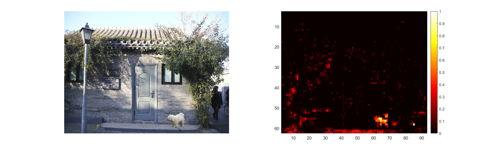
          
      背景二
          
      
          
      合成图二
          
      
          
      检测二
          
      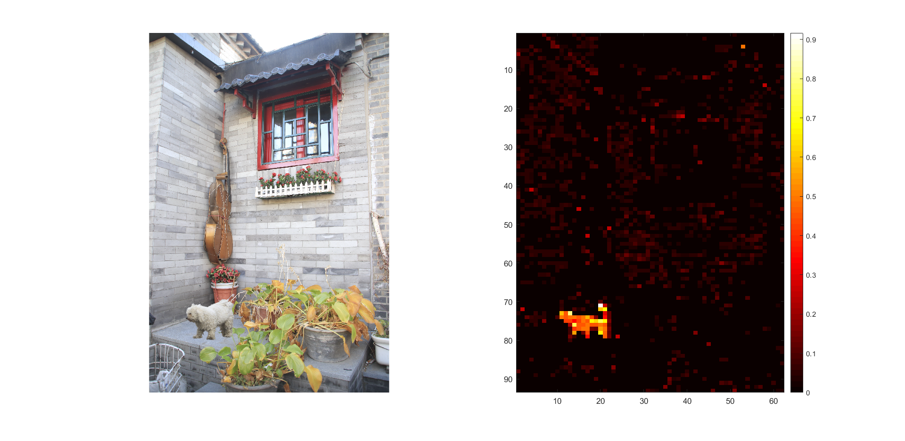
          
      背景三
          
      
          
      合成图三
          
      
          
      检测三
          
      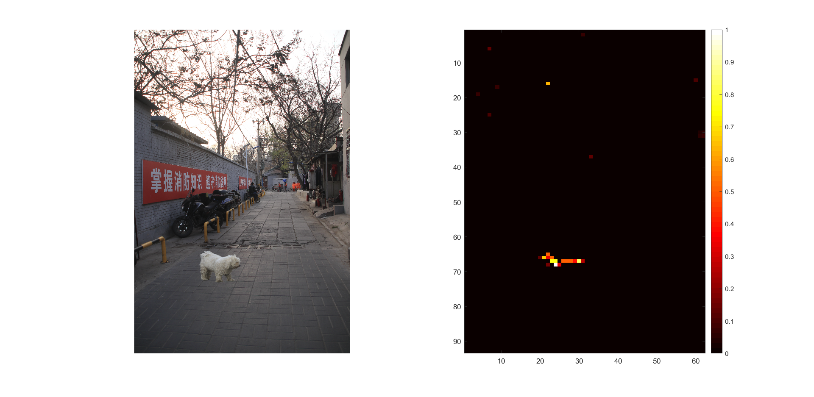
          
      背景四
          
      
          
      合成图四
          
      
          
      检测四
          
      blocksize = 55
          
      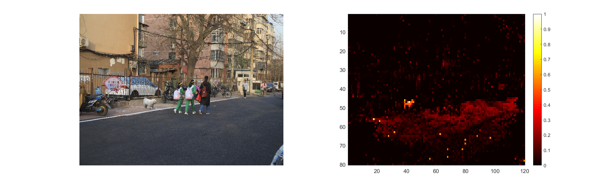
          
      blocksize = 64
          
      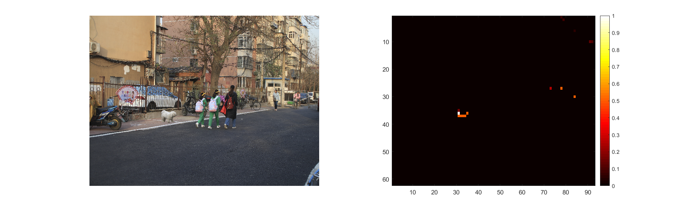
    
- 统计性测试
  - 检测块大小的影响
    - 越小 检测的越细，越接近纹路
    - 越大 检测的越粗
  - 误检率应该如何算