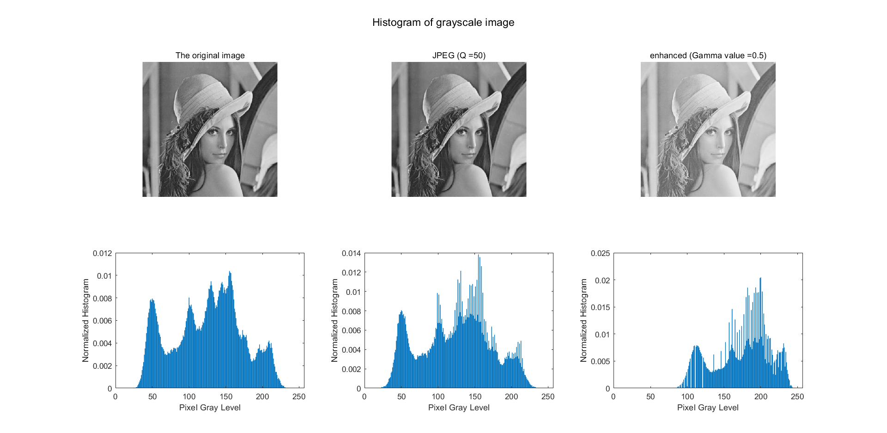
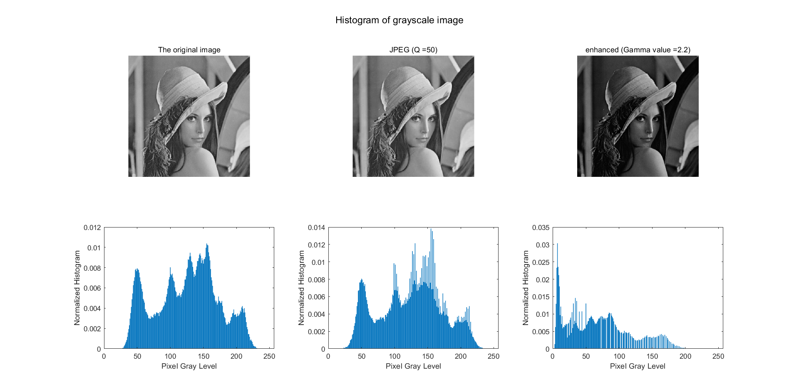

# 全局对比度增强检测

## 分析经过gamma校正后的灰度直方图的变化情况

- 确定研究的灰度直方图的对象
  - **注意：确定到底是以R，G，B还是以Y通道作为研究的平面**

- 峰谷效应原理检测
  - 彩色图
    - 选择灰度图像Y分量查看的效果非常不明显
    - 试图看到底是会不会有0值
    - green channel的现象很明显
      - 是不是有特殊性
      - 而且还和gamma的值有关，不一定能检测得到

  - 灰度图bmp效果很明显
        
        
- 测试阈值
- gamma校正的参数：gamma correction $m(x)=round(255×(x/255)^r)$ r=0.5 0.7 0.9 1.1 1.5 2.0
- 映射函数的参数和式子：m(x) = round(255(arcsin(2x/255 − 1)/π + 1/2))

# 分析源对比度增强的图片

## 问题：
- EDR的确定
  - 出现原因:在低分辨率和内容单一的图像中，灰度直方图通常比较狭窄，仅覆盖[0,255]内的部分区间
- peak bins
  - 1.首先将gap bin的地方填充，形成一个新的直方图a
    - 填充的方法：用临近的几个bins的均值填充
    - 取值为：2，4，6，8，10，12
  - 2.对该直方图进行中值滤波处理得到直方图b，然后再对比b和a之间的差值来检测峰值
    - 中值滤波窗口尺寸 3x3 5x5 7x7 9x9
  - 3.peak positions are located by thresholding the difference between the gap-filled histogram and its filtered version 要阈值化
    - 差值大于某个阈值，认为是peak gap，否则不是
- 检验的步骤
  - 1.先求detected
  - 2.再求co-existing gap position Vg
  - 3.将Vg和每一个的Vgi做哈德曼乘积 放回原来的就是校正的
- 矢量的1-范数：`向量元素绝对值之和`
- 如何找the reference position vector
  - Gap reference
    - 找到一个区域是具有最多的谷值的，他的值就是参考向量：原因是the block with the largest number of zero-height gap bins is believed to locate within one source region
  - Peak reference
    - 需要由$m_g$和指定阈值$t_g$来得到
    - 对于每一个像素k从0-255，求一个指示函数
    - 指示函数的内容是，找所有的块（满足该块的$m_g>t_g$）的$V_{pc}$加在一起，如果该值大于0，则指示函数为1，反之为0
    - $t_g$的取值为0.5~0.8


* 彩色图像如何做gamma校正
  * 怎么做直接决定怎么测
  * rgb三通道同步做对应的伽马次幂运算 -> 就应该直接在rgb三通道上检测峰谷效应
    * 这种方法没有鲁棒性，校正后的图像存为jpg时，基本上看不到峰谷效应
    * 如果将rgb转化为灰度通道是看不到效应的，因为是在rgb上进行操作的
* 实际应用中图像增强通常在`亮度通道`做，保持色差通道不变，此时峰谷效应会出现在亮度通道，不在rgb通道
* 都可以假设在灰度图像做实验
* [lin2rgb](https://ww2.mathworks.cn/help/images/ref/lin2rgb.html) Apply gamma correction to linear RGB value 

* 对直方图如何进行中值滤波
    不能调用对图像处理的中值滤波和均值滤波的函数

问题:
* matlab的实时脚本
* hist \ histogram 的用法
  - 指定直方图的bin间隔
  ```matlab
  xbins1 = -4:4
  hist(x,xbins1) % 设置bin的间隔
  ```
* reshape出现的意义
  
# 看老师的代码学到了
- 读文件夹的方法
  ```matlab
  path = 'C:\xxx\xxx\'
  sub_dir = dir(path)
  for i = 3:size(sub_dir,1)
    path_image = strcat(path,sub_dir(i).name);
    im = double(imread(path_image));
  end
  ```
- 获取归一化的直方图为
  ```matlab
  im是二维矩阵、灰度通道、亮度通道、绿色通道等
  [hist_y] = hist(reshape(im,size(im,1)*size(im,2),1),0:1:255);
  hist_y = hist_y/sum(hist_y);
  figure;bar([0:255],hist_y,1);
  ```
- gamma校正
  ```matlab
  im2 = 255*((im/255).^r);
  ```
- 测量谷值
  ```matlab
  % 设置滑窗长度
  wndsize = 3;
  threshold = 0.001;
  pgMark = zeros(1,256);
  for i = 4:256-3 % 因为滑窗的长度为3，所以要从4开始
      % 统计[k-wndsize,k+wndsize]的和的均值
      average = mean([hist(max(i-wndsize,1):n-1),hist(n+1,min(i+wndsize,255))]);
      pgMark(i) = ((his(n)==0)*(average>threshold)*(min(hist[n-1],hist[n+1])>threshold);
  end
  % 返回为1点的下标
  res = find(pgMark==1);
  % 统计1的个数
  if ~isempty(tp)
    Num = length(tp);
  end
  ```
- 生成单源和双源图像
- 检测peakbin
  - have not considered the first and end 3 bins 原因是什么？？
  - 阈值化检测的简便写法
      ```matlab
      % 做阈值化检测
      pPosit_vect = hist_dif > threPeak;
      % 在EDR有效区内进行处理
      pPosit_vect = pPosit_vect.*der;
      ```
- sum(二维矩阵) 返回二维矩阵的列之和
- select gap reference vector
    ```matlab
    % 所有块的gap值存在gap二维矩阵中
    index = find(sum(gap,2)==max(sum(gap,2)));
    gap_re = gap(index(1),:);
    ```
- EDR的检测和老师的想法不一样
  - 正确的想法：
    - 为什么选择在经过gapfill和filter后的直方图上进行查找，表示已经去掉了峰谷效应后，在上面寻找EDR更为合理

      ```matlab
      % hist_out是在经过gapfill和filter后的直方图
      EDR = ones(1,256);
      wndsize = 5;
      for n = 1:256
          % 如果某个滑窗内的最大值都小于一个阈值 那么这个值不能作为有效检测区
          if max(hist_out(max([1,n-wndsize]):min([256,n+wndsize])))<1*10^(-3) 
            EDR(n) = 0; % denote the EDR
          end
      end
      ```
- 对一个矩阵进行~ 该矩阵是0、1的double类型的矩阵 也可变成 logical 就是正常取反
- size(im,1)取的是行
- 乘以-10 应该是为了扩大现象
- 掐头去尾现象？？ 前三个后三个
- 试图沿模糊的维增大数组。
参考文献：
*[Fast contrast enhancement by adaptive pixel value stretching](https://www.researchgate.net/publication/326900656_Fast_contrast_enhancement_by_adaptive_pixel_value_stretching?from=singlemessage)
* [直方图归一化normalization](http://fourier.eng.hmc.edu/e161/lectures/digital_image/node9.html)