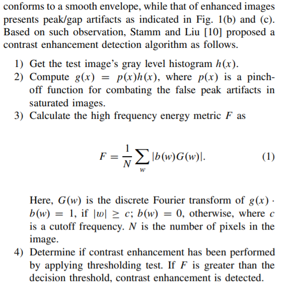
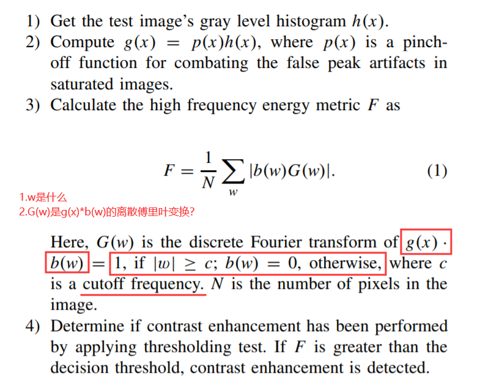
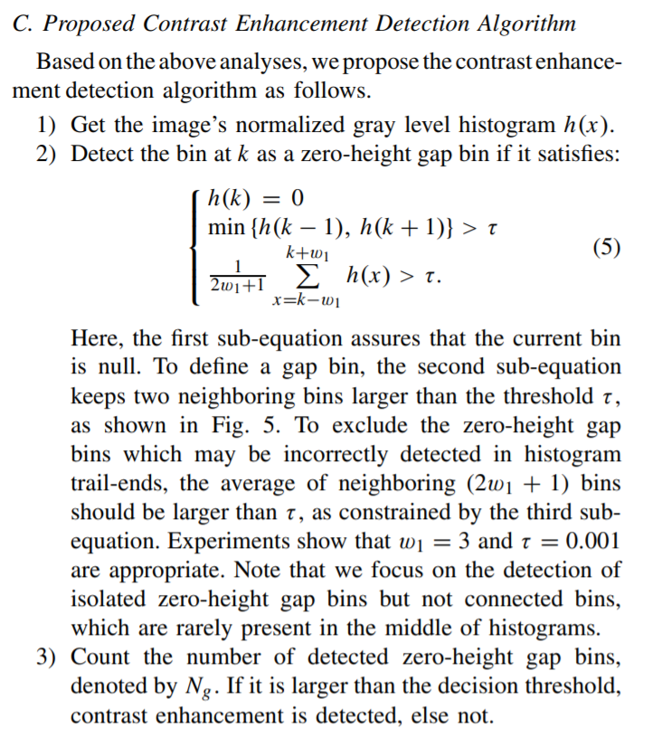

# 研究论文

## Introduction
- 基于对比度增强(Contrast Enhancement)的数字图像取证
  
- 两种情形
  - 修饰图片 调整`全局`亮度和对比度
    - 引出问题：我们要检测的是全局的亮度、对比度是否被调整过？
  - 恶意篡改 `局部`对比度增强
  
- 盲检测
  
- 两种算法 
  - 全局对比度增强检测 `之前经过?`JPEG压缩的图片
    - 原理：JPEG压缩后直方图的峰值(the histogram peak/gap artifacts)/像素映射(pixel value mappings)/0高度间隙?(zero-height gap fingerprint)
  - 识别经过对比度调整的图片的区域
    - 原理：regional artifacts的连续性？ -> 锁定合成图像的(composition)位置

- 应用场景
  - law enforcement and news recording 执法和新闻纪录
  - 图像经过处理的操作步骤

- 图像操作的检测方法(我大致看了一下) -> 提出观点：没有提出精确的操作类型
  - 基于分类器的方法进行图像操作检测
    - 二值相似性(binary similarity)
    - 图像质量
    - 小波统计(wavelet statistics)

- 图像检测的目的
  - non-content-changing operations
    - resampling 
    - compression
    - sharpening filtering
    - contrast enhancement 
    - median filtering
  - contentchanging operations
    - splicing & composition 拼接和合成

- 其他算法的缺陷
  - 对比度增强的鉴别算法的原理 一个未经过任何修改的图片的灰度直方图轮廓平滑
  - 经过特别大的压缩(low quality factor:Q) -> blocking artifacts 块效应？ -> 引起灰度直方图(unsmoothness and even locally dense peak bins in the gray level histogram)的变化 -> 所以假设图片没被拼接合成修改过 但是被压缩了 也无法检测对比度增强 
- single-source-enhanced and both-source-enhanced？这两个术语是什么 可以这样理解吗？ 只调整了粘贴图的对比度/调整了粘贴图和被粘贴图的对比度
- 解决方法：zero-height gap bins的盲检测
  - peak/gap pattern of the pixel value mapping??
  - 看不懂：Peak/gap pattern of the pixel value mapping applied to each source region is self-learned from the detected blockwise peak/gap positions.
  - 检测不同区域的位置向量的不一致性 the inconsistency between the position vectors in different regions

## II Previous Works
-  Global Contrast Enhancement Detection 全局对比度增强的检测
    -  对比度增强的实现原理
      -  映射函数 a pixel value mapping y=m(x)
      -  x,y 0~255 8bit图像
      -  图是什么意思
         
      -  ~~检测对比度增强的算法~~ 由于检测效果不好，被否决
            
          -  获取图像的灰度直方图h(x)
          -  计算g(x)=p(x)h(x) p(x)  a pinchoff function for combating the false peak artifacts in saturated images
          -  w是什么？ G(w)是g(x)*b(w)的离散傅里叶变换
                
          -  确定阈值 计算出的F大于阈值，则有全局的对比度增强
      - 适用范围
          - 检测经过对比度增强后的图片
          - 识别经过jpeg压缩后和线性像素值拉伸(对比度增强的一种)
          - 无法处理一般的非线性的像素值映射的检测
          - 线性和非线性的通俗化讲法？？
              - 线性变化(f(x)=a*x+b) 线性拉伸(分段线性变化)

    - 老师提出的算法
      - 在未经过压缩和经过压缩后的图片都可以检测
      - 研究JPEG压缩后的peak/gap artifacts
        - JPEG步骤
          - 值从[0,255]-[-128,127] 移位？
          - 8*8分块
          - DCT 块离散余弦变换
          - 量化
          - 熵编码(entropy encoding)
        - 两个因素影响JPEG图像直方图的峰值的存在
          - the flatness
          - JPEG quality factor
          - 越大的平滑区和更大的直流量化步长 -> 引起更明显的峰值
          - 灰度直方图的不连续？
      - 研究经过对比度增强的peak/gap artifacts
        - 更多的x经过映射函数m(x)得到y，若很多x都能映射到相同的y，则y的值会变多，从而造成峰值
      - JPEG压缩引起的和对比度增强引起的直方图的变化的区别
        - 因为经过JPEG压缩后的灰度直方图是没有0值的间隙(因为缺少像素映射)，但是经过对比度增强后的灰度直方图有 -> 所以可以检测
        - the zero-height gap feature can be used to detect global contrast enhancement in both uncompressed and compressed images. 0值的间隙特征能用于检测经过压缩和未经过压缩的全局的对比度增强
      - 提出算法
           

    - 我们自己的仿真实验
      - 先处理一个经过全局对比度调整的图片

- Local Contrast Enhancement Detection 局部对比度增强的检测
  - 合成图片 有不同的色温(color temperature)和亮度对比度 -> 要对one or both source regions进行对比度的变换
  - 上述的方法不行的原因：当是both-source-enhanced composite images时候 无法检测

- source-enhanced是什么意思，源增强？发生了对比度增强操作的图片吧
- identify the source-enhanced composite image created by enforcing contrast adjustment on either single or both source regions
- 原理：positional distribution of the peak/gap bins incurred by contrast enhancement is unique to the involved pixel value mapping,such positional information could serve as fingerprinting feature for identifying different contrast enhancement manipulations. Consistency between the peak/gap artifacts detected in different regions is checked for discovering composite images

- Blockwise Peak/Gap Bins Location
  - the test image I is first divided into nonoverlapping blocks i=1,2...$N_b$ $N_b$是分块的数量
  - Gap Bins Location
    - 对于第i个块，在它的灰度直方图的峰谷效应出现在 看上面的检测方法
    - 该块为Gap Bins则置为1，否则置为0
  - Peak Bins Location
    - Peak Bins的检测方法：media filtering通过中值滤波可以定位出具有脉冲噪声特性的峰值
      - 谷值gap bins被邻居的值所填满(the gap bins are first filled with the average of neighboring bins)
      - 中值滤波操作在 gap-filled histogram
      - filtered histogram 有平滑的轮廓
      - 峰的位置：阈值化确定gap-filled histogram(填满谷后的直方图)和它的过滤后的版本之间差值 
      - 求一个filtered gap-filled version of the histogram、histogram difference for the enhanced and unenhanced image
      - 我的理解：首先将gap bin的地方填充，形成一个新的直方图a，对该直方图进行中值滤波处理得到直方图b，然后再对比b和a之间的差值来检测峰值
    - 实际上，峰谷效应在对比度增强后不一定更能够出现，因为 直方图太窄了以至于无法填充柱子的位置
      - 解决方法：EDR(Effective Detection Range) 对于第i块的峰谷位置向量，是一个灰度级不为零的的集合
      - EDR以外的直方图的bins都是为0的
      - 低分辨率产生的窄的灰度直方图，大部分位置向量的EDR实际上包含了有限的灰度级
    - 为了降低检测的错误，提取的峰谷位置被在大部分块中保持共生的峰谷效应所纠正 被认为是由所涉及的映射决定的
      - threshold-based binarization 基于阈值的二值化
- Gap Based Similarity Measure
  - 为任何一个设置一个参考位置向量(reference position vector) 用于区分两个源区域
  - 原理:根据每块的位置向量和参考位置向量的相似度 对块进行分类，具有非常接近的相似度的块可以认为是来自同一个图片
  - 参考位置向量的选取
    - 不能从拼接的边界选择
    - 一个有着最大数量的zero-height gap bins的块被认为是在一个源区域内的，而在边界区域，由于来自不同源区的像素的交互是得zero-height bins减少
- Peak Based Similarity Measure
  - 方法：识别峰值的的原因是identify mapping
- Similarity Maps Fusion for Composition Detection 合成检测中的相似图融合

- Dataset 1: 10 unaltered photograph images in png format
- Dataset 2: database provide by teacher
  
- 做实验的积累
  - Gamma Correction 伽马校正：对图像的伽玛曲线进行编辑，以对图像进行`非线性色调`编辑的方法，检出图像信号中的深色部分和浅色部分，并使两者比例增大，从而提高图像对比度效果。计算机绘图领域惯以此屏幕输出电压与对应亮度的转换关系曲线，称为伽玛曲线(Gamma Curve)
  - Gamma校正只有灰度图吗 主要针对的是灰度图

- 每张测试图 由通过一系列的决定的阈值 来进行判断是否经过对比度增强
- 正确率和误检率
- the overlap of the peak/gap positions incurred by s mapping and gamma correction
- 将图像的一个区域用gamma r1处理，图像的另一个区域用gamma r2处理，这两个区域是随计选择的

- 实验缺陷
  - 对后处理不鲁棒，post-processing
    - 只能用于某些场景：对比度增强是图像的`最后一步操作`
    - 因为后处理会影响zero-height gap bins的检测
  
## 思路总结
- propose two contrast enhancement based forensic algorithms via histogram peak/gap artifacrs analysis
  - global contrast enhancement via zero-height gap bins in gray level histograms
    - uncompressed images
    - previously JPEG-compressed images
  - discover the both-source-enhanced composite image
    - locate the composition boundary via detecting the inconsistency between detected blockwise peak/gap positional distribution
    - could work well when contrast enhancement is performed as the last step of manipulation

## 另一篇论文

* CE：contrast enhancement
  * 提出一个有效增强对比度的算法
  * our proposed technique could be enforced automatically without complex manual parameters adjustment per image. 自动实施CE，无需对每张图像进行复杂的手动参数调整
  * contrast-distorted 对比度失真
* CE操作的对象
  * pixel domain 像素域 `the direct manipulation of pixel gray levels(namely pixel values)`
  * transform domain 变换域 
* matlab function imadjust(ADJ)：将一部分的像素值饱和，来将像素值的动态范围扩大到最大值
  * improve ADJ by importing automatic and adaptive parameter configuration via images
  * adaptive pixel value stretching and adaptive gamma correction
  * applied in automatic mode without specially selecting parameters for each image every time
  * extend the dynamic range of pixel gray levels adaptively through pixel value stretching, and recover the normal global luminance by adaptive gamma correction

cost-effective