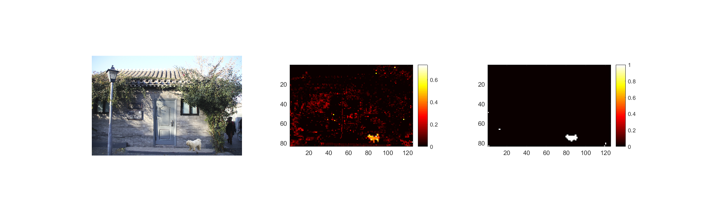
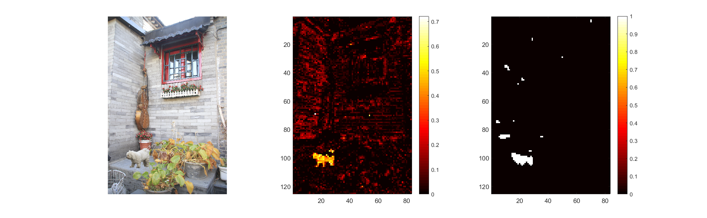
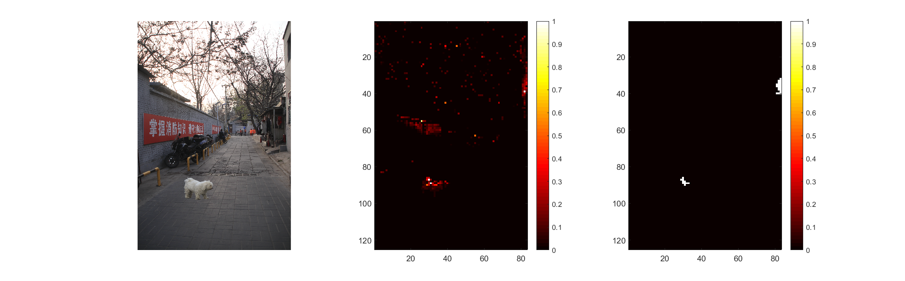
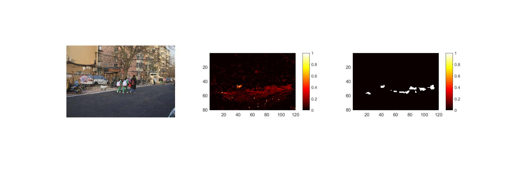
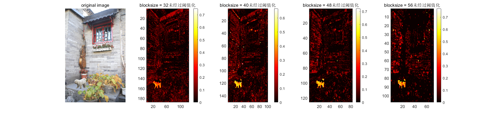
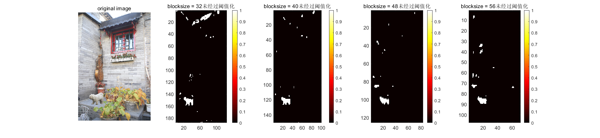
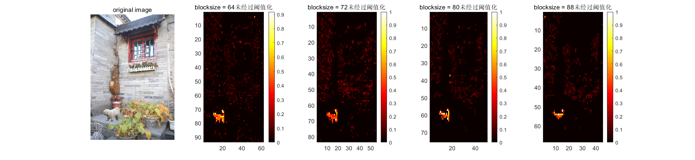

- 经过二值化后的图
    检测的分块大小为48，前一张图是未经过阈值化的图，后一张图是经过阈值化的图

    

    检测的分块大小为48，前一张图是未经过阈值化的图，后一张图是经过阈值化的图

    

    检测的分块大小为48，前一张图是未经过阈值化的图，后一张图是经过阈值化的图

    

    检测的分块大小为50，前一张图是未经过阈值化的图，后一张图是经过阈值化的图

    

- blocksize的影响
  - 不好检测正确率，所以就用肉眼判断了一下，检测的效果

    

    

    

    

  - 总结：块越小，图像的纹理检测的越清楚，但是检测的干扰项变多了，但是块越大，干扰因素小，但是正检的区域也变小

- 正确率的计算
  - 保证blocksize不变的情况下去检测正确率

- JPG压缩后处理
  