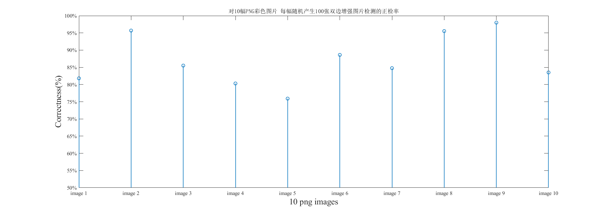
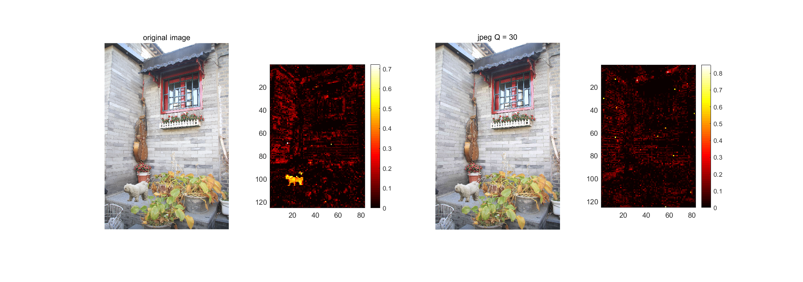
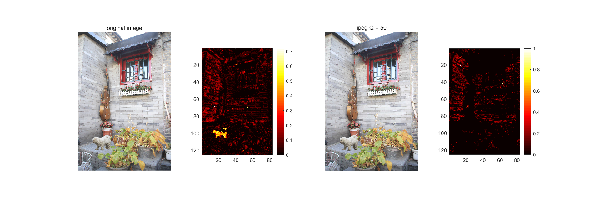
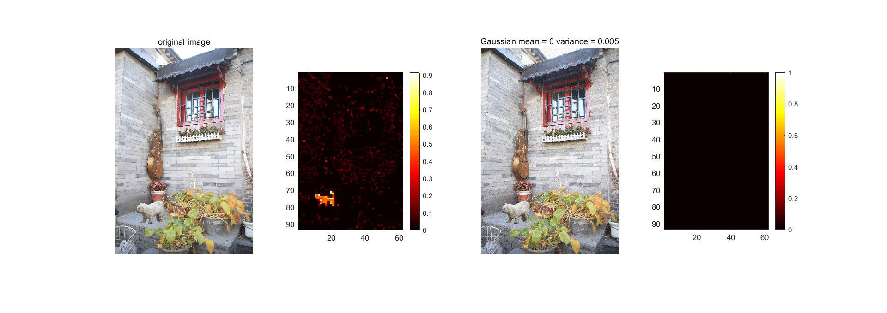
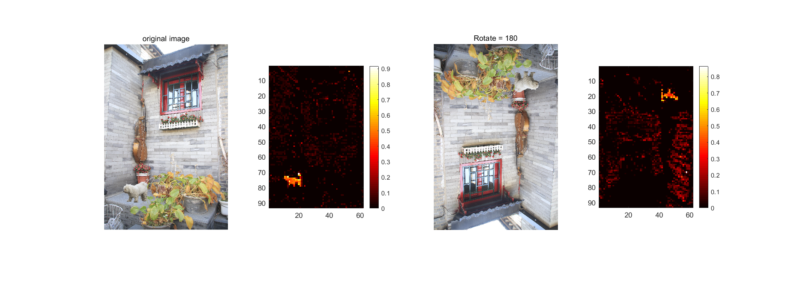
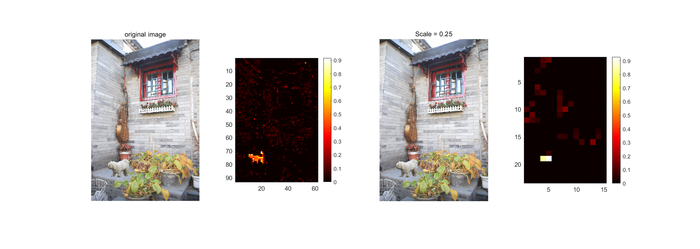

- 经过二值化后的图
    检测的分块大小为48，前一张图是未经过阈值化的图，后一张图是经过阈值化的图

    

    检测的分块大小为48，前一张图是未经过阈值化的图，后一张图是经过阈值化的图

    

    检测的分块大小为48，前一张图是未经过阈值化的图，后一张图是经过阈值化的图

    

    检测的分块大小为50，前一张图是未经过阈值化的图，后一张图是经过阈值化的图

    

- blocksize的影响
  - 不好检测正确率，所以就用肉眼判断了一下，检测的效果

    

    

    

    

  - 总结：块越小，图像的纹理检测的越清楚，但是检测的干扰项变多了，但是块越大，干扰因素小，但是正检的区域也变小

- 正确率的计算
  - 保证blocksize不变的情况下去检测正确率
  
    

- JPG压缩后处理

  - 只要有一个不能检测出来，就说明不能抵抗jpeg后处理
      - jpeg q 30 blocksize = 48

          

      - jpeg q 50 blocksize = 48

          

      - jpeg q 50 blocksize = 64

          

  - 加噪

      blocksize = 64/48 高斯噪声

      

  - 旋转

      blocksize = 64 

      

  - 缩放

      