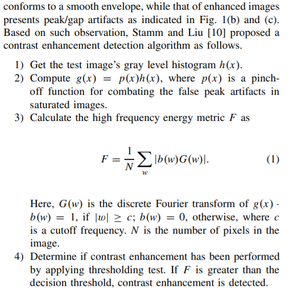
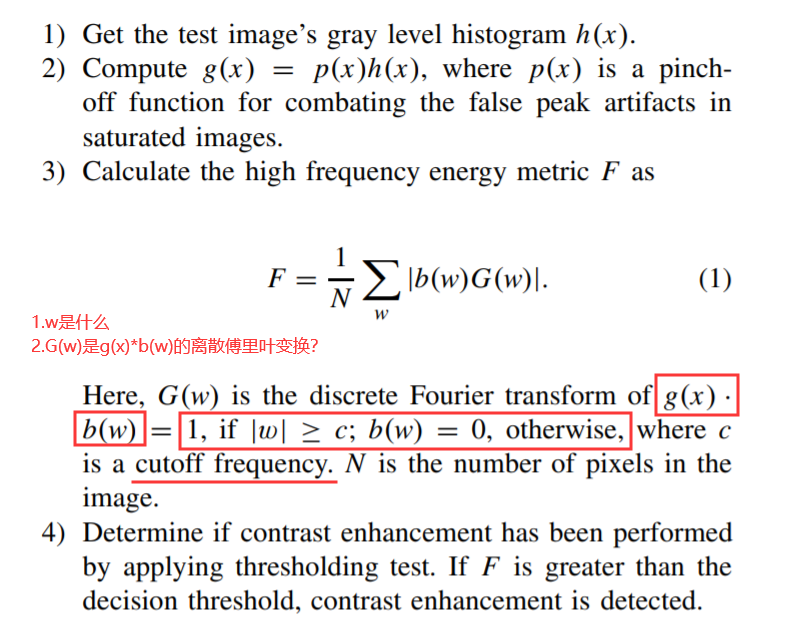

老师后面的太难了，目前只看到`C. Proposed Contrast Enhancement Detection Algorithm`部分，有些问题想问一下老师。
1. single-source-enhanced and both-source-enhanced？这两个术语可以这样理解吗？ 只调整了粘贴图的对比度/调整了粘贴图和被粘贴图的对比度
2. ~~检测对比度增强的算法~~ 由于在both-source-enhanced的合成图片检测效果不好，被否决
    
    
    
    -  获取图像的灰度直方图h(x)
    -  计算g(x)=p(x)h(x) p(x)  a pinchoff function for combating the false peak artifacts in saturated images
    -  w是什么？ G(w)是g(x)*b(w)的离散傅里叶变换
        
        

    -  确定阈值 计算出的F大于阈值，则有全局的对比度增强
3. 右上角的小图是什么意思
    
    

4. blockwise histogram是灰度直方图？
5. peak/gap artifacts到底是一个怎样的体现：是峰值的突出和出现了零值的特征？
    - peak artifacts
    - gap artifacts
        

6. 检测全局对比度增强的总结(是否正确)
    -  峰值效应(peak)
        -  在JPEG压缩后的灰度直方图会不连续，峰值peak效应会明显？
        -  在经过对比度增强后，首先对比度增强的原理是原图的x经过映射函数m得到y，若很多x都能映射到相同的y，则y的值会变多，从而造成灰度直方图的峰值出现
    -  零值效应(gap) 
        -  zero-height gap是自行定义的
        -  经过JPEG压缩后的灰度直方图是没有0值的间隙，但是经过对比度增强后的灰度直方图有
        -  有0值的原因是因为`像素映射`
    -  **确定具体的算法**
         
         

        -  获取图像的灰度直方图(normalize指的就我们一般求的灰度直方图吧)
        -  确定zero-height gap的定义
           -  灰度直方图在该处k的值为0 h(k)=0
           -  灰度直方图在k-1和k+1处的值都要大于一个阈值$τ,min(h(k-1),h(k+1)) > τ$
           -  排除在灰度直方图末尾的错误检测$\frac{1}{2w_1+1} \sum^{k+w_1}_{x=k-w_1}{h(x)>τ}$
           -  一般$w_1 = 3,τ = 0.001$
        -  统计灰度直方图上zero-height gap的总数，当个数大于一个给定的阈值的时候能够证明有对比度增强的操作
        -  如何确定最终检测的阈值：要经过统计测试实现？
   